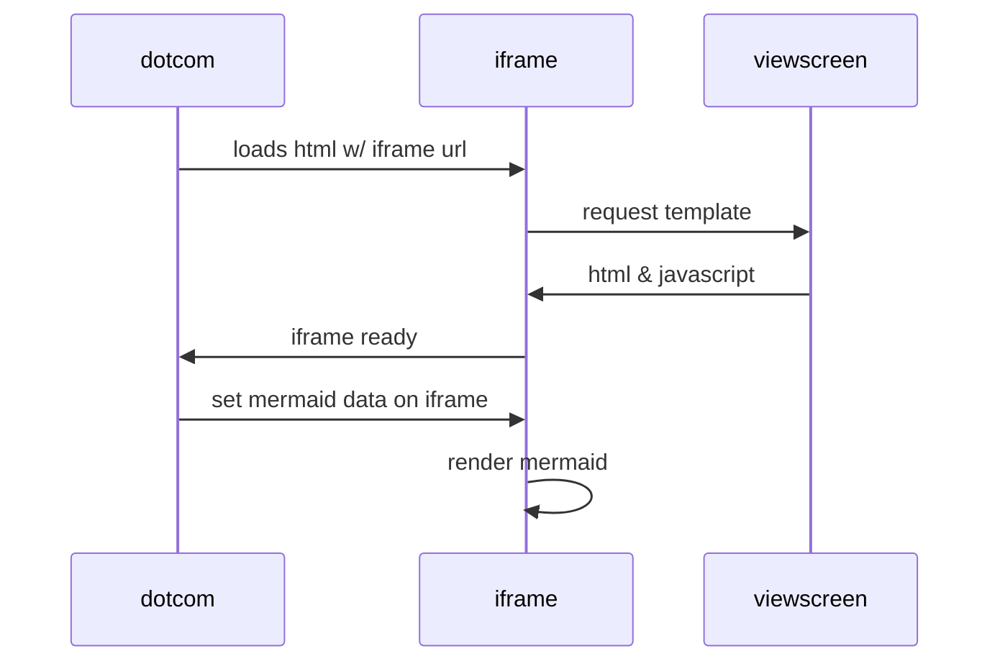

# Описание
Классификатор текстовых сообщений. 

Минимальная реализация - программа запускается в консоли и на ввод любого текстового сообщения 
отвечает наименованием класса, к которому оно относится. 

Необходимо присвоить один из четырех классов: 

- кредит, 

- кредитная карта, 

- дебетовая карта, 

- не определено.

Тренировочная и тестовая часть - во вкладках train и test.

Основное требование - способность программы верно определять сообщения которых нет в датасетах. 
Точность выполнения будем определить по нашему внутреннему тестовому датасету, 
из слов которых нет в файле. По итогу будем оценивать процент верно определенных запросов. 

# Запуск

# Требования

#####

regex.py -> заданные правила для поиска класса
nlp_clean.py -> очистка текста, сравнивание train_data с тестовыми
ml.py -> tf-df, метод ближайших соседей

# Очистка текста
